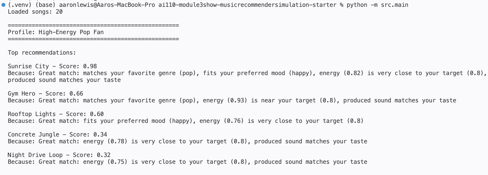
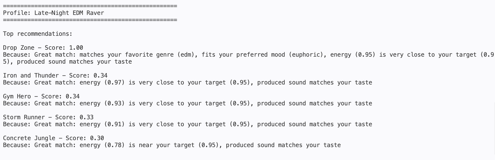

# 🎵 Music Recommender Simulation

## Project Summary

In this project you will build and explain a small music recommender system.


Replace this paragraph with your own summary of what your version does.

---

## How The System Works


**Real World Reccomenders**
Real-world music recommenders like Spotify and YouTube operate across three distinct layers. First, input data is the raw features the system ingests — song attributes like genre, mood, tempo, energy, and acousticness, plus metadata like artist or release year. Second, user preferences are not stated directly but derived from behavior: plays, skips, replays, and saves train the system to build a taste profile, essentially a weighted vector of the feature values you respond to most. Third, ranking and selection is where the system scores every candidate song by how closely its feature vector matches that preference profile and surfaces the top results. In practice, platforms blend this content-based filtering with collaborative filtering ("users like you also liked X") and apply business rules as a final re-rank before display.


Each `Song` uses four features in scoring: `genre` and `mood` as categorical identifiers, and `energy` and `acousticness` as continuous values. The other fields — `title`, `artist`, `id` — are identity fields used only for display. `tempo_bpm`, `valence`, and `danceability` are present in the data but excluded from scoring because they're correlated with `energy` and have no matching preference field in `UserProfile`.

The `UserProfile` stores exactly four preference fields that mirror those song features: `favorite_genre` (a string like `"pop"`), `favorite_mood` (a string like `"happy"`), `target_energy` (a float representing the user's ideal intensity level), and `likes_acoustic` (a boolean indicating whether the user prefers organic or electronic-sounding tracks).

The `Recommender` computes a score for each song by combining four sub-scores into a weighted sum. Genre and mood each produce a 1.0 or 0.0 depending on whether they match exactly. Energy uses proximity scoring — `1 - |song.energy - user.target_energy|` — so a song at 0.82 beats one at 0.95 when the target is 0.80. Acousticness rewards either high or low values depending on the `likes_acoustic` boolean. The final score is `0.35 × genre + 0.30 × mood + 0.25 × energy + 0.10 × acoustic`.

Songs are chosen by running every song in the catalog through that scoring function, sorting all results from highest to lowest score, and returning the top `k` songs. The default is `k=5`, but the caller can override it. No filtering happens before scoring — every song gets evaluated and the ranking alone determines what surfaces.

---

## Getting Started

### Setup

1. Create a virtual environment (optional but recommended):

   ```bash
   python -m venv .venv
   source .venv/bin/activate      # Mac or Linux
   .venv\Scripts\activate         # Windows

2. Install dependencies

```bash
pip install -r requirements.txt
```

3. Run the app:

```bash
python -m src.main
```

### Running Tests

Run the starter tests with:

```bash
pytest
```

You can add more tests in `tests/test_recommender.py`.

---

## Experiments You Tried

**First Screenshot**

The recommender confidently identified "Sunrise City" as a near-perfect match (0.98) since it aligns on genre, mood, and energy, while the remaining slots were filled by other high-energy, produced-sound tracks that shared at least one strong feature.

**Second Screenshot**

"Moonlit Sonata" dominated with a 0.99 score by matching genre, mood, energy, and acoustic preference all at once, and the rest of the top 5 were drawn from ambient, folk, and blues tracks that shared its quiet energy and high acousticness even without a genre or mood match.


**Third Screenshot**

"Drop Zone" scored a perfect 1.00 by hitting every single preference exactly, and since no other song comes close on genre or mood, the runner-up slots went to metal, rock, and pop tracks that simply had the highest raw energy in the dataset.

**Fourth Screenshot**

"Focus Flow" locked in a 0.98 by matching genre, mood, energy, and acoustic preference all at once, while "Library Rain" and "Midnight Coding" both hit 0.67 by sharing the lofi genre and acoustic texture but missing the mood match — a reminder that mood's 0.30 weight is nearly as decisive as genre's 0.35. The bottom two slots went to non-lofi tracks that happened to land near the 0.40 energy target with acoustic sound, scoring only 0.33 each.

Energy is the most powerful differentiator across profiles. The EDM raver (target 0.95) and the pop fan (target 0.80) pull entirely from the top half of the energy range, while the acoustic listener (target 0.25) pulls exclusively from the bottom — the two groups share zero songs in their top 5.


---

## Limitations and Risks

This recommender works on a catalog of only 20 songs, uses exact string matching for genre and mood so near-misses like "indie pop" and "pop" score zero, and applies hand-tuned fixed weights that were never validated against real listener feedback — meaning it can confidently surface the wrong results for users whose tastes don't fit the assumed feature hierarchy. It also has no memory of past plays, so it recommends the same songs every run with no ability to introduce variety or discovery over time.

---

## Reflection

Read and complete `model_card.md`:

[**Model Card**](model_card.md)

Reflection included in Model Card.md

---

## 7. `model_card_template.md`

Completed in that file. 

Combines reflection and model card framing from the Module 3 guidance. :contentReference[oaicite:2]{index=2}  

```markdown

